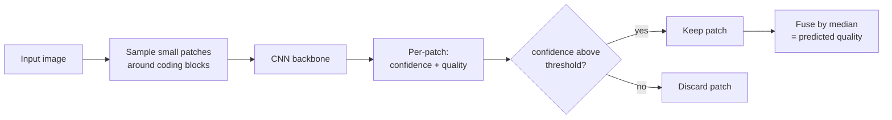
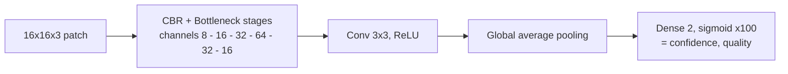
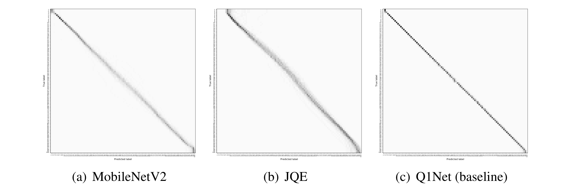

# Q1Net: Quality Level Prediction of Image Compression using Block-wise Confidence-aware CNN

[](https://github.com/chammoru/Q1Net/actions/workflows/ci.yml)
[](https://bmva-archive.org.uk/bmvc/2021/conference/papers/paper_0813.html)
[](LICENSE)

Official implementation of the BMVC 2021 paper.
Paper: https://bmva-archive.org.uk/bmvc/2021/conference/papers/paper_0813.html

Q1Net predicts the quality level of a compressed image (e.g. the JPEG quality
factor) directly from the image, using a block-wise, confidence-aware CNN.

## Highlights
- **Real-time:** predicts the compression quality level in milliseconds, fast
  enough to run on mobile devices.
- **Accurate:** over 99% accuracy in the paper's experiments.
- **Block-wise & confidence-aware:** exploits the characteristic deformations
  transform coding leaves on small blocks, estimates a per-patch confidence, and
  fuses only the reliable patches instead of processing the whole image.
- **Deployable:** exports to TensorFlow Lite for on-device inference.

## How it works
Instead of looking at the whole image, Q1Net samples small patches around coding
blocks, runs a lightweight CNN on each patch to predict a quality value together
with a confidence, keeps only the high-confidence patches, and fuses them:



The per-patch backbone is a compact residual CNN operating on 16x16x3 patches:



CBR is Conv to BatchNorm to ReLU; the bottleneck is a 1x1 to 3x3 to 1x1 residual
block. The confidence-aware loss down-weights unreliable patches during training.

## Results
Confusion matrices over 10,000 compressed images spanning all 100 quality levels
(Figure 4 from the [paper](https://bmva-archive.org.uk/bmvc/2021/conference/papers/paper_0813.html)).
A sharper diagonal means more accurate quality prediction: Q1Net (c) produces a
markedly tighter diagonal than MobileNetV2 (a) and JQE (b), staying accurate
across the full quality range.



### Robustness to off-grid crops (2026 update)
JPEG block boundaries sit on an 8x8 grid only as long as the image has not been
cropped; a crop at an arbitrary offset shifts the grid phase. The training
pipeline now stores patches one block larger (24x24) with the top-left corner
aligned to the compression grid, and crops the 16x16 network input at a random
sub-block offset every epoch, so the model stays accurate on images whose pixel
alignment is no longer a multiple of 8.

The bundled `jpeg_paper` weights were fine-tuned this way for 45 epochs on DIV2K
(see [`notebooks/kaggle_train.ipynb`](notebooks/kaggle_train.ipynb) for the
reproducible Kaggle run). Image-level MAE over 15 DIV2K-valid images at 10
quality levels, against the previous checkpoint:

| | aligned | cropped off-grid (3,5) |
|---|---|---|
| previous weights | 0.36 | 0.44 |
| drift-trained weights | **0.31** | **0.37** |

## Authors
- Kyuwon Kim (chammoru at gmail, q1.kim at samsung)
- Chulju Yang (ijn9429 at gmail, chulju at samsung)

## Citation
```bibtex
@InProceedings{kim2021q1net,
  title     = {Quality Level Prediction of Image Compression using Block-wise Confidence-aware CNN},
  author    = {Kim, Kyuwon and Yang, Chulju},
  booktitle = {Proceedings of the British Machine Vision Conference (BMVC)},
  month     = {November},
  year      = {2021}
}
```

## Requirements
- Python 3 (tested on 3.12)
- The pinned packages in [`requirements.txt`](requirements.txt) (TensorFlow 2.16,
  installed in the setup step below)

TensorFlow 2.16 defaults to Keras 3, but this project uses the Keras 2 API.
`env.sh` exports `TF_USE_LEGACY_KERAS=1` so the `tf-keras` (Keras 2) implementation
is used.

## Dataset
This project uses the [DIV2K dataset](https://data.vision.ee.ethz.ch/cvl/DIV2K/).

## Clone and setup
The pretrained model weights are tracked with [Git LFS](https://git-lfs.com/),
so install it **before** cloning:
```bash
# install Git LFS once per machine, then enable it for your user
git lfs install

git clone https://github.com/chammoru/Q1Net.git
cd Q1Net

# (recommended) create and activate a virtual environment
python3 -m venv .venv
source .venv/bin/activate

# install the pinned dependencies
pip install -r requirements.txt

# go to the source directory and set up the environment
# (adds the repo root to PYTHONPATH and exports TF_USE_LEGACY_KERAS=1)
cd classifier
. ./env.sh
```

If you already cloned the repository without Git LFS, fetch the weights with:
```bash
git lfs pull
```

### Pretrained weights without Git LFS
If you cannot use Git LFS, download `q1net-weights.zip` from the
[Releases page](https://github.com/chammoru/Q1Net/releases) and extract it at the
repository root so that `classifier/save/<comp_type>/best/` contains the checkpoint
files (`.index` and `.data-*`). The commands that load the model print a clear error
if the weights are missing or are still unresolved Git LFS pointers.

The supported compression types (`--comp_type`) are `jpeg_paper` and `jpeg_paper_k12`.

## Prediction
Predict the quality level of a single image:
```bash
python3 ./predict_cls.py --in_path ../sample_image/monarch_jpeg_q20.png --comp_type jpeg_paper
```
The sample image is JPEG quality 20, so the output is close to 20:
```
predicted quality 20.01, estimated in 0.135 seconds
```

## Evaluation
Evaluate over a directory of images. Each image is compressed at every quality
level, predicted, and compared against the ground truth; the mean absolute error
is reported and a confusion matrix is saved to `--out_path` (default `out/`).
```bash
# Download the validation set
wget https://data.vision.ee.ethz.ch/cvl/DIV2K/DIV2K_valid_HR.zip
unzip DIV2K_valid_HR.zip

python3 evaluate_cls.py --comp_type jpeg_paper --in_path DIV2K_valid_HR
```

## Training
```bash
# Download the training set
wget https://data.vision.ee.ethz.ch/cvl/DIV2K/DIV2K_train_HR.zip
unzip DIV2K_train_HR.zip

sh batch_train_jpeg_paper.sh
```
During training, `gen_data.py` generates an HDF5 file of training data that
`train.py` then consumes. `gen_data.py` stores 24x24 grid-aligned patches and
the training sequence applies random sub-block drift crops (see the Results
update above); `train.py` accepts `--lr` for fine-tuning and `--verbose 2` for
non-interactive runners.

To train on a free Kaggle GPU instead, push
[`notebooks/kaggle_train.ipynb`](notebooks/kaggle_train.ipynb) with the Kaggle
CLI (`kaggle kernels push -p notebooks`); it downloads DIV2K, generates the
datasets, fine-tunes for 45 epochs, and compares against the committed weights.

## Convert the model to TFLite
```bash
python3 ./to_tflite.py --comp_type jpeg_paper
```

## Applications
Q1Net can benefit a wide range of applications, including:
- Image/photo editors
- (Streaming) video players and photo viewers
- Web browsers
- Video conferencing
- Instant messaging apps
- And many more

For example, knowing the compression quality of a photo (such as the ID photo in a
mobile driver's-license app below) lets an app decide whether to enhance it before
display:


> Image source: Yonhap News (watermarked); used here for illustration only.

## License
This code is released for **non-commercial research and evaluation purposes only**.
The methods implemented here are covered by U.S. Patent No. 12,462,356 B2, owned by
Samsung Electronics Co., Ltd.; **no patent license is granted**, and commercial use
requires a separate license. See [LICENSE](LICENSE) for the full terms.
